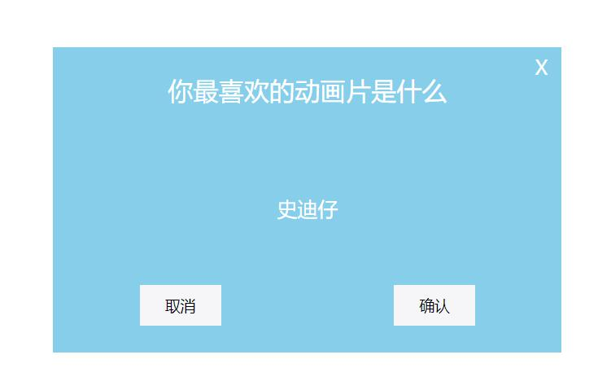

 #对话框组件效果说明
==================================

*本页面点击按钮，自动生成div，可实现拖拽点击效果*

## css部分
```
	.content{
		/* width:500px;
		height:300px;
		background-color:Skyblue;
		font-size:;
		color:#fff;
		position:absolute;
		left:50%;
		top:50%;
		transform:translate(-50%,-50%); */
		position:absolute;
	}
	i{
		display:inline-block;
		font-style:normal;
		width:20px;
		height:20px;
		font-size:20px;
		color:#fff;
		text-align:center;
		line-height:20px;
		position:absolute;
		right:10px;
		top:10px;
	}
	.header{
		width:100%;
		height:28%;
		/* border-bottom:1px solid #bbb; */
		background-color:;
		font-size:25px;
		color:#fff;
		text-align:center;
		display:flex;
		justify-content:center;
		align-items:center;
	}
	.con{
		width:100%;
		height:50%;
		background-color:;
		font-size:20px;
		color:#fff;
		display:flex;
		justify-content:center;
		align-items:center;
	}
	.footer{
		width:100%;
		height:20%;
		background-color:;
		display:flex;
		justify-content:space-around;
	}
	.footer input{
		width:80px;
		height:40px;
		border:none;
		outline:none;
		background-color:#f6f6f9;
		font-size:15px;
	}

```

## html部分
```
	<input id="btn" type="button" value="点击">
	<!-- <div class='content'>
		<i id='del'>X</i>
		<div class='header'>你最喜欢的动画片是什么？</div>
		<div class='con'>史迪仔</div>
		<div class='footer'>
			<input id='left' type='button' value='否'>
			<input id='right' type='button' value='是'>
		</div>
	</div> -->
```

## html里js部分
```
	var obj={
		_w:"500",//宽
		_h:"300",//高
		_title:"你最喜欢的动画片是什么",//标题
		_con:"史迪仔",//内容
		_color:"#fff",//字体颜色
		_bgcolor:"Skyblue",//背景颜色
	}
		
	//点击按钮
	btn.onclick=function(){
		btn.style.display="none";//隐藏按钮
		var spring=new Spring(obj);//创建对象
	}
```

## js部分
```
	//构造函数
	function Spring(obj){
		this.content=null;//内容为空
		this.mouseX=0;//鼠标X轴
		this.mouseY=0;//鼠标Y轴
		this.posX=0;//弹框X轴
		this.posY=0;//弹框Y轴
		this.isDrag=false;//默认不可以拖动
		this.maxWidth=document.documentElement.clientWidth;//窗口宽
		this.maxHeight=document.documentElement.clientHeight;//窗口高
		this.obj={//自定义属性
			width:obj._w,//宽
			height:obj._h,//高
			title:obj._title,//标题
			con:obj._con,//内容
			color:obj.color,//字体颜色
			bgcolor:obj._bgcolor,//背景颜色
		};
		this.addChild();//生成div
		this.move();//移动
		this.delete();//删除
	}
	
	//生成DOM节点
	Spring.prototype.addChild=function(){
		this.hy=document.createElement("div");//创建div
		this.hy.className="content";//设置class
		this.hy.style.width=this.obj.width+"px";//设置宽
		this.hy.style.height=this.obj.height+"px";//设置高
		this.hy.style.color=this.obj.color;//设置字体颜色
		this.hy.style.background=this.obj.bgcolor;//设置背景颜色
		this.hy.style.left=(this.maxWidth-this.obj.width)/2+"px";
		this.hy.style.top=(this.maxHeight-this.obj.height)/2+"px";
		this.hy.innerHTML="<i id='del'>X</i><div class='header'>"+this.obj.title+"</div><div class='con'>"+this.obj.con+"</div><div class='footer'><input id='left' type='button' value='取消'><input id='right' type='button' value='确认'></div>";//内容
		
		document.body.appendChild(this.hy);//上树
	}
	
	//移动div时
	Spring.prototype.move=function(){
		var that=this;//备份
		
		//鼠标按下时
		this.hy.onmousedown=function(event){
			//console.log("按下鼠标");
			var event=event || window.event;
		
			that.mouseX=event.pageX;//点击鼠标时的X轴
			that.mouseY=event.pageY;//点击鼠标时的Y轴
			that.posX=that.hy.offsetLeft;//获取X轴
			that.posY=that.hy.offsetTop;//获取Y轴
			
			that.isDrag=true;//可以拖动
		}
		
		//鼠标按下并移动时
		this.hy.onmousemove=function(event){
			//console.log("按下鼠标并开始移动");
			var event=event || window.event;
			
			var x=event.pageX;//移动时的x坐标
			var y=event.pageY;//移动时的y坐标
			
			//判断是否移动
			if(that.isDrag){
				var xx=that.posX+x-that.mouseX;//移动后的left
				var yy=that.posY+y-that.mouseY;//移动后的top
				
				that.hy.style.left=xx+"px";//X轴
				that.hy.style.top=yy+"px";//Y轴
			} 
		}
		
		//当鼠标离开时
		this.hy.onmouseup=function(){
			//console.log("鼠标离开");
			that.isDrag=false;//禁止移动
		}
	}
	
	//删除div
	Spring.prototype.delete=function(){
		var btn=document.getElementById("btn");//点击按钮
		var that=this;
		//点击X
		del.onclick=function(){
			document.body.removeChild(that.hy);//删除wrap
			btn.style.display="block";//显示按钮
		}
		//点击取消
		left.onclick=function(){
			document.body.removeChild(that.hy);//删除wrap
			btn.style.display="block";//显示按钮
		}
		//点击确认
		right.onclick=function(){
			document.body.removeChild(that.hy);//删除wrap
			btn.style.display="block";//显示按钮
		}
	}
```

## 
### 联系人：hy
### 联系方式：123 1234 1234